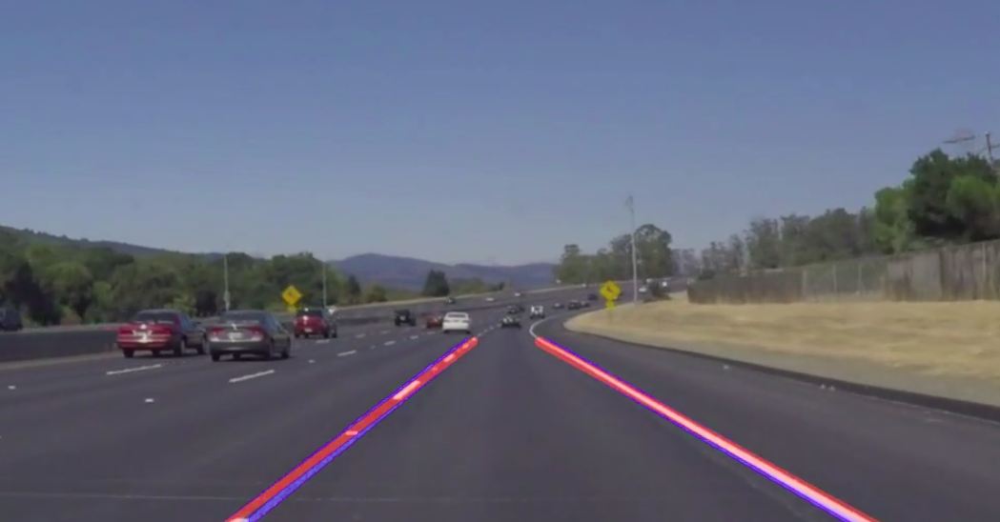
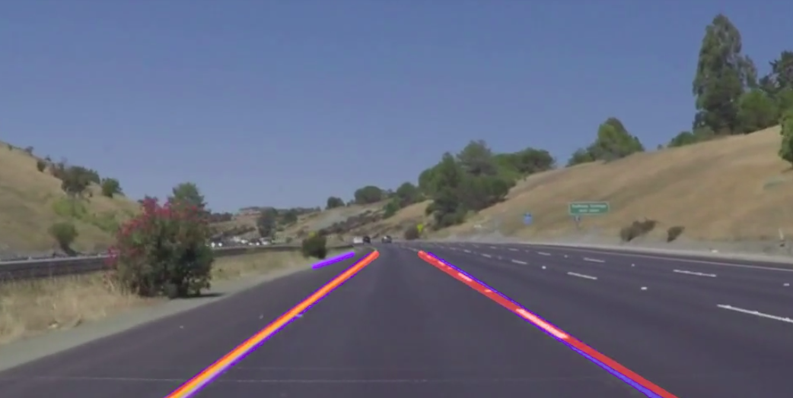
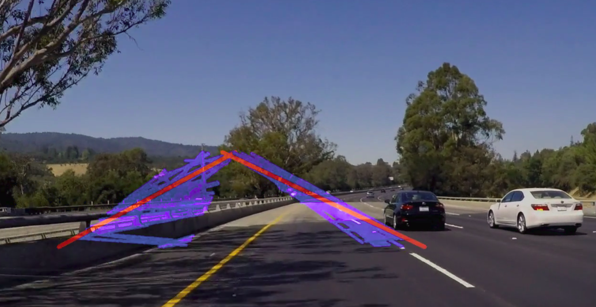

# **Finding Lane Lines on the Road** 

## Writeup Template

### You can use this file as a template for your writeup if you want to submit it as a markdown file. But feel free to use some other method and submit a pdf if you prefer.

---

**Finding Lane Lines on the Road**

The goals / steps of this project are the following:
* Make a pipeline that finds lane lines on the road
* Reflect on your work in a written report


[//]: # (Image References)

[image1]: ./examples/grayscale.jpg "Grayscale"

---

### Reflection

### 1. Describe your pipeline. As part of the description, explain how you modified the draw_lines() function.

My pipline is very simple, here is my code：
```python
def two_region_pipline_image(image,  kernel_size=5, low_threshold=50, high_threshold=100, rho=2, theta=np.pi/180, threshold=20, min_line_len=25,max_line_gap=300, is_gray=True):
    img_gray = grayscale(image)
    img_blur = gaussian_blur(img_gray, kernel_size)
    img_canny = canny(img_blur, low_threshold, high_threshold)
    
    vertices_left = np.array([[[400,330],[500,330],[400,530],[140,530]]],dtype=np.int32)
    vertices_right = np.array([[[480,330],[530,330],[900,530],[780,530]]],dtype=np.int32)
    
    img_region_left = region_of_interest(img_canny, vertices_left)
    img_region_right = region_of_interest(img_canny, vertices_right)
    
    img_hough = hough_lines_new(img_region_left, img_region_right, rho, theta, threshold, min_line_len, max_line_gap)
    img_weig = None
    if is_gray:
        img = np.concatenate([img_canny[:,:,None], img_canny[:,:,None], img_canny[:,:,None]], axis=2)
        # img = np.concatenate([img_region_right[:,:,None], img_region_right[:,:,None], img_region_right[:,:,None]], axis=2)
        img_weig = weighted_img(img_hough, img, α=0.8, β=0.5, λ=0.)
    else:
        img_weig = weighted_img(img_hough, image, α=0.8, β=0.5, λ=0.)
    return img_weig
```

My pipeline consisted of 5 steps. 

#### Step 1~3 is the same to the previous project
- I converted the images to grayscale
- Blured the image with `kernel_size = 5`
- Used `canny` algorithm to find the edge of picture

#### The special thing I have done
- modify some of code in `hough_lines` to use tow roi to extract the straight line respectively and then add them together. After running the code:

```python
def hough_lines_new(img1, img2, rho, theta, threshold, min_line_len, max_line_gap):
    """
    把两个区域拼接在一起
    """
    lines1 = cv2.HoughLinesP(img1, rho, theta, threshold, np.array([]), minLineLength=min_line_len, maxLineGap=max_line_gap)
    lines2 = cv2.HoughLinesP(img2, rho, theta, threshold, np.array([]), minLineLength=min_line_len, maxLineGap=max_line_gap)
    line_img = np.zeros((img1.shape[0], img1.shape[1], 3), dtype=np.uint8)
    # draw_lines_new(line_img, lines1)
    draw_lines_new(line_img, lines2)
    return line_img
```
it would look like that:


- I modify `draw_line` function using the Extrapolation Algorithm. Because of using two roi, my code seems easy to understand:

```python
def draw_lines_new(img, lines, color=[255,0,0], thickness=8):
    """
    根据斜率画一条长长的线(左)
    """
    points = []
    try:
    # print (lines)
        for line in lines:
            for x1, y1, x2, y2 in line:
                points.append((x1, y1))
                points.append((x2, y2))

        points_sort = sorted(points, key=lambda x:x[0])
        l_b_x, l_b_y = points_sort[0]
        r_t_x, r_t_y = points_sort[-1]
        middle_y = (r_t_y + l_b_y) / 2.
        middle_x = (l_b_x + r_t_x) / 2.
        k = (r_t_y - l_b_y) / float(r_t_x - l_b_x)
        # print (k)
        x_top = (330 - middle_y)/k + middle_x
        x_bottom = (530 - middle_y)/k + middle_x
        s = (int(x_top), 330)
        e = (int(x_bottom), 530)
        cv2.line(img, s, e, color, thickness)
    except:
        pass
```

- Finally, I added the line into the original picture and the result was great:








### 2. Identify potential shortcomings with your current pipeline


Help!!! I can not use it into the curve lin. It was terrible. Can you give some advice?




### 3. Suggest possible improvements to your pipeline

Making some modify so that I can test it in the curve line.
